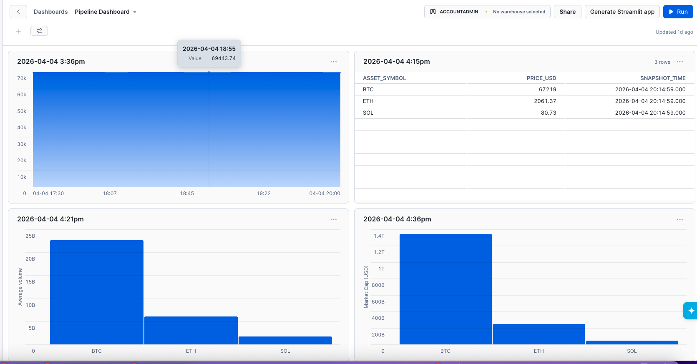
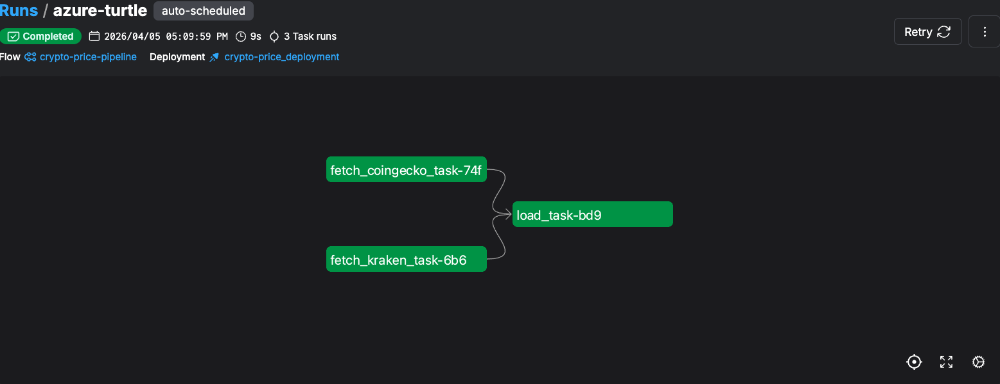

# Crypto Price Pipeline (Multi-Source)

## Why I built this

I wanted to understand how data from different crypto APIs can disagree.

Instead of using just one source, I pulled data from:
- CoinGecko (aggregated market data)
- Kraken (exchange-specific data)

Then I stored everything in Snowflake and compared the results.


## What this pipeline does

- Fetches crypto prices every 5 minutes
- Normalizes data from different APIs into one schema
- Stores everything in Snowflake
- Lets me compare prices and volumes across sources


## Architecture
```
CoinGecko API        Kraken API
↓                         ↓
Python Fetch Layer (Normalization)
↓
Prefect Orchestration
↓
Snowflake (Warehouse)
↓
Snowsight Dashboard
```

## Dashboard
 


## Prefect flow




### Price comparison
- BTC, ETH, SOL from CoinGecko vs Kraken

### Volume comparison
- shows difference between global vs exchange volume

### Price trend
- tracks changes over time


## Example insight

Kraken volume is much smaller than CoinGecko.

This makes sense because:
- CoinGecko aggregates across exchanges
- Kraken is just one exchange


## Tech used

- Python
- Snowflake
- Prefect
- REST APIs

## Key Design Decisions

- Used a unified schema to normalize data across APIs
- Added a `source` column to support multi-source comparison
- Used MERGE in Snowflake to ensure idempotent loads
- Shared the same snapshot timestamp across sources for accurate comparison

## What I learned

- how to design multi-source pipelines
- how to normalize data across APIs
- how to handle missing fields (e.g. market cap in Kraken)
- how to use window functions for latest records


## How to run

Start Prefect:
```
prefect server start
```
Run pipeline:
```
python -m flows.prefect_flow
```


